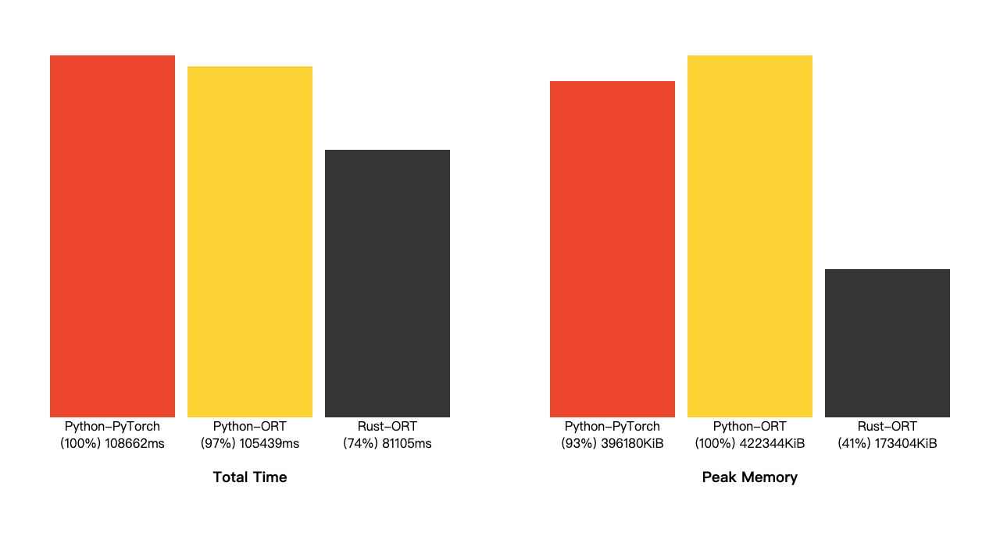

# Emch: Benchmark v2 GUIDE

## Sec 1. Environment
Before we start, let's check out the status of my machine:

### OS Version
```
Mac OS X 10.15.7 (Catalina)
Darwin Kernel Version: 19.6.0
```

### Hardware Information
```
Hardware Model: MacBookPro9,2
Installed Memory Size: 8GB
CPU name: Dual-Core Intel Core i5
CPU frequency: 2.5GHz
Physical CPU cores: 2
Logical CPU cores: 4
```

### Toolchain Information
```
Python 3.10.6
rustc 1.70.0
cargo 1.70.0
zsh 5.7.1
BSD time utility
```

In this benchmark, I operate ML inference on Intel CPU with 2 cores only.

## Sec 2. Targets
I'd like to see how fast can a Sentence Trasformer model be.
There is only one task: Semantic search on [BelR/scifact](https://huggingface.co/datasets/BeIR/scifact) dataset.
1. get all embeddings of queries (text) and corpus (title).
2. compute cosine similarity for all pairs of queries and corpus.
3. get the id of corpus with the highest similarity.
4. if the id is contained in qrels (the answer), it hits.
5. the score is `(hits / query total count)`

I run the task with some similar approaches, and compare their total execution time, to find the fastest approach.
The model name is `sentence-transformers/all-MiniLM-L6-v2`.
My approaches:
1. Python-PyTorch: PyTorch model, run with Hugging Face's `optimum.bettertransformer` in Python
2. Python-ORT: ONNX model, run with Hugging Face's `optimum.onnxruntime` in Python
3. Rust-ORT: ONNX model, run with the crate `pykeio/ort` in Rust

## Sec 3. Comparision
Histogram:


Measured with BSD `time` utility:
```log
0.4310189359783589
python3.10 -m src.python.pytorch
user:   188491ms or 188491427us
kernel: 10054ms or 10054260us
total:  108662ms or 108661979us
cpu:    182%
memory: 396180 KiB

0.4328223624887286
python3.10 -m src.python.ort
user:   222566ms or 222566105us
kernel: 7616ms or 7616380us
total:  105439ms or 105438651us
cpu:    218%
memory: 422344 KiB

0.43282238
./target/release/ort
user:   149488ms or 149488232us
kernel: 3048ms or 3048443us
total:  81105ms or 81105056us
cpu:    188%
memory: 173404 KiB
```

## Sec 4. Steps to reproduce

### 1. Installation
1. get Python dependencies:
```
pip install -r pipreqs.txt
```

2. get models (in pt and onnx format):
```
./scripts/download_transformer_in_pytorch_and_onnx.py
```

3. get Rust dependencies:
```
cargo b -r
```

All in one:
```
pip install -r pipreqs.txt && \
./scripts/download_transformer_in_pytorch_and_onnx.py && \
cargo b -r
```

### 2. Data conversion
Covert the original `BelR/scifact` dataset ([Download here](https://public.ukp.informatik.tu-darmstadt.de/thakur/BEIR/datasets/scifact.zip)) to custom data format:
```
./src/python/utils/get_data_for_inference_semantic_search_on_scifact.py
```

### 3. Measuring execution time and see results
```
time python3 -m src.python.pytorch && \
time python3 -m src.python.ort && \
cargo b -r && time ./target/release/ort
```

### 4. Batch size?
In `src/python/pytorch.py`, `src/python/ort.py` and `src/rust/ort.rs`, a constant named `BATCH_SIZE` is for configuring batch size. The sentence count to execute in parallel. (probably)
On my machine, this is the best setting now:
Python PyTorch: 8
Python ORT: 2
Rust ORT: 2

## Sec 5. Implementation details
See `Cargo.toml`, `pipreqs.txt`, `src/`, `scripts/` and `tests/`

## Sec 6. Are we fast yet?
No, the benchmark is currently based on **naive** approaches. My Rust implementation has a lot to improve. I'd like to run more complex tasks. I'd like to make this benchmark more realistic, more useful and more surprise.

*(The result vary on different machines)*

---
**Author: Asher Chen**
