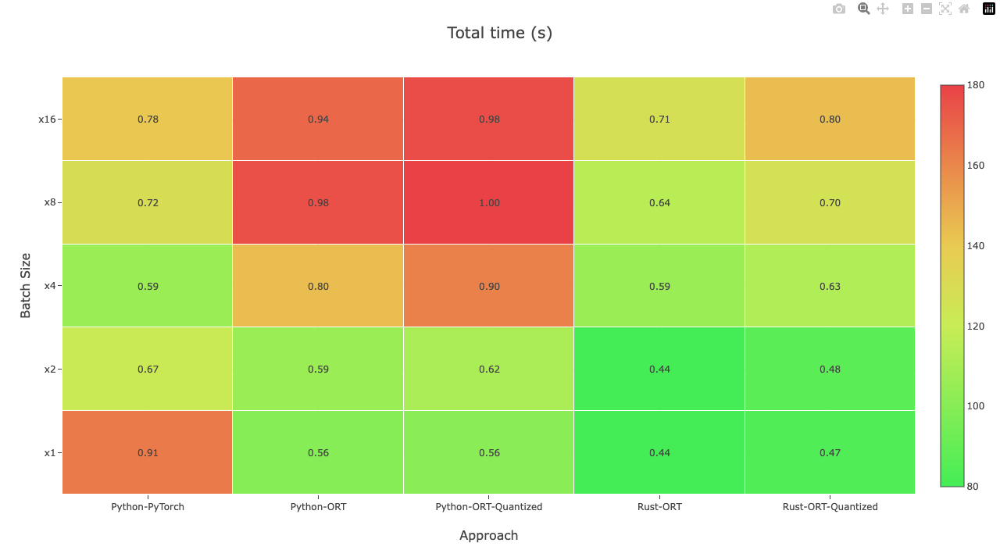
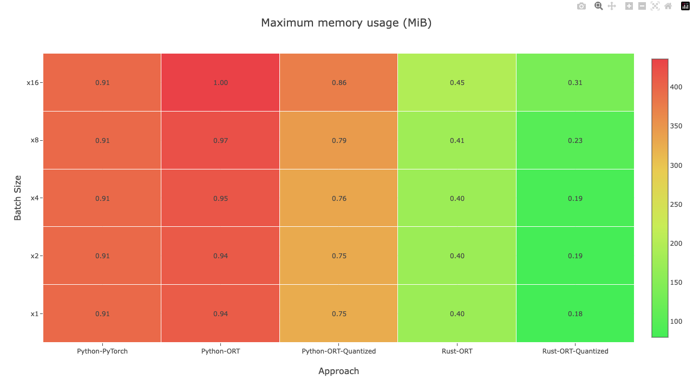

# Emch: Benchmark v3 GUIDE

## Sec 1. Environment
Before we start, let's check out the status of my machine:

### OS Version
```
Mac OS X 10.15.7 (Catalina)
Darwin Kernel Version: 19.6.0
```

### Hardware Information
```
Hardware Model: MacBookPro9,2
Installed Memory Size: 8GB
Processor name: Dual-Core Intel Core i5
Processor speed: 2.5GHz
Number of Physical CPU cores: 2
Number of Logical CPU cores: 4
```

### Toolchain Information
```
python 3.10.6
rustc 1.70.0
cargo 1.70.0
zsh 5.7.1
BSD time utility
```

In this benchmark, I have operated ML inference on this Intel CPU with 2 physical cores only.

## Sec 2. Targets
I'd like to see how fast can a Sentence Trasformer model be.

There was only one task: Semantic search on [BelR/scifact](https://huggingface.co/datasets/BeIR/scifact) dataset with the BERT model `sentence-transformers/all-MiniLM-L6-v2`.

Steps in the task:
1. get all embeddings of queries (text) and corpus (title).
2. compute cosine similarity for all pairs of queries and corpus.
3. get the id of corpus with the highest similarity.
4. if the id is contained in qrels (the answer), it hits.
5. the score is `(hits / number of queries)`

I've run the task with some approaches, and compared their total execution time, to find the fastest approach.

My approaches:
1. Python-PyTorch: PyTorch model, run with Hugging Face's `optimum.bettertransformer` in Python
2. Python-ORT: ONNX model, run with Hugging Face's `optimum.onnxruntime` in Python
3. Rust-ORT: ONNX model, run with the crate `pykeio/ort` in Rust
4. Python-ORT-Quantized: ONNX model with dynamic quantization, run with Hugging Face's `optimum.onnxruntime` in Python
5. Rust-ORT-Quantized: ONNX model with dynamic quantization, run with the crate `pykeio/ort` in Rust

## Sec 3. Comparision
The performance was measured with BSD time utility, see this log file [here](./misc/benchmark-v3.log)

The heatmaps in HTML is [here](./docs/benchmark-v3.html), and I've taken some screenshots of it:



## Sec 4. Steps to reproduce

### 1. Installation
1. get Python dependencies:
```
pip install -r pipreqs.txt
```

2. get models in PyTorch and convert to ONNX format (and quantized version with suffix `_q`):
```
./scripts/download_transformer_and_convert.py
```

3. get Rust dependencies:
```
cargo b -r
```

**All in one:**
```
pip install -r pipreqs.txt && \
./scripts/download_transformer_and_convert.py && \
cargo b -r
```

### 2. Data conversion
You need to convert the original `BelR/scifact` dataset ([Download here](https://public.ukp.informatik.tu-darmstadt.de/thakur/BEIR/datasets/scifact.zip)) to custom data format:
```
./packages/python/utils/get_data_for_inference_semantic_search_on_scifact.py
```

### 3. Run the task
Use the command after you have configured the program:
```
SIZE_LIST=(1 2 4 8 16);
for size in $SIZE_LIST; do
  export BATCH_SIZE=$size;
  echo $BATCH_SIZE;
  time python3 -m src.python.pytorch;
  time python3 -m src.python.ort;
  time python3 -m src.python.ort_q;
  cargo b -r --bin ort && time ./target/release/ort;
  cargo b -r --bin ort_q && time ./target/release/ort_q;
done
```

### 4. Batch size?
The environment variable named `BATCH_SIZE` is for configuring batch size in every testing scripts.

## Sec 5. Implementation details
See `Cargo.toml`, `pipreqs.txt`, `packages/`, `scripts/` and `tests/`

This is my BSD time utility's format (TIMEFMT environment variable):
```
%J
user:   %mU or %uU
kernel: %mS or %uS
total:  %mE or %uE
cpu:    %P
memory: %M KiB
```

## Sec 6. Are we fast enough now?
No, the benchmark is currently based on **naive** approaches. My Rust implementation has a lot to improve. I'd like to run more complex tasks. I'd like to make this benchmark more realistic, more useful and more surprise.

*(The result vary on different machines)*

---
**Author: Asher Chen**
